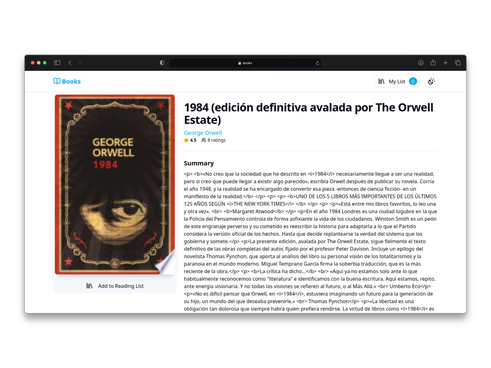

# Books - Create and manage your own reading list

### Description
Web application developed to help users organize and manage personalized reading lists. It allows you to search for book titles using the Google Books API, with filters by publication year, genre, and page count. The app automatically saves your list to local storage so you can access it at any time. It also features infinite scrolling for a smooth browsing experience.

### Links
[Link to Web](https://courageous-duckanoo-60d5e2.netlify.app/?order=relevance)

### Tech Stack
* React
* Vite
* Tailwind Css
* Zustand

### Screenshots

